# Realtime Anomaly Detection Using Google Cloud Stream Analytics and AI Services
This repo provides a reference implementation of a Cloud Dataflow streaming pipelines that integrates with BigQuery ML, Cloud AI Platform, and AutoML (coming soon!) to perform anomaly detection use case as part of real time AI pattern. It contains reference implementations for the following real time anomaly detection use cases:  

1. Finding anomalous behaviour in netflow log to identify cyber security threat for a Telco use case.
2. Finding anomalous transaction to identify fraudulent activities for a Financial Service use case.     

## Table of Contents  
* [Anomaly detection in Netflow log](#anomaly-detection-in-netflow-log).  
	* [Reference Architecture](#anomaly-detection-reference-architecture-using-bqml).      
	* [Quick Start](#quick-start).  
	* [Learn More](#learn-more-about-this-solution). 
	* [Mock Data Generator to Pub/Sub Using Dataflow](#test). 
	* [Train & Normalize Data Using BQ ML](#create-a-k-means-model-using-bq-ml )
	* [Feature Extraction Using Dataflow](#feature-extraction-after-aggregation). 
	* [Realtime outlier detection using Dataflow](#find-the-outliers). 
	* [Sensitive data (IMSI) de-identification using Cloud DLP](#dlp-integration). 
	* [Looker Integration](#looker-integration). 
	
* [Anomaly detection in Financial Transactions](#anomaly-detection-in-financial-transactions). 
	* [Reference Architecture](#anomaly-detection-reference-architecture-using-cloud-ai). 
	* [Build & Run](#build--run-1)
	* [Test](#test-1)
	
	  		 
## Anomaly Detection in Netflow log
This section of the repo contains a reference implementation of an ML based Network Anomaly Detection solution by using Pub/Sub, Dataflow, BQML & Cloud DLP.  It uses an easy to use built in K-Means clustering model as part of BQML to train and normalize netflow log data.   Key part of the  implementation  uses  Dataflow for  feature extraction & real time outlier detection which  has been tested to process over 20TB of data. (250k msg/sec). Finally, it also uses Cloud DLP to tokenize IMSI  (international mobile subscriber identity) number as the streaming Dataflow pipeline  ingests millions of netflow log form Pub/Sub.   

Securing its internal network from malware and security threats is critical at many customers. With the ever changing malware landscape and explosion of activities in IoT and M2M, existing signature based solutions for malware detection are no longer sufficient. This PoC highlights an ML based network anomaly detection solution using PubSub, Dataflow, BQ ML and DLP to detect mobile malware on subscriber devices and suspicious behaviour in wireless networks.

This solution implements the reference architecture highlighted below. You will execute a <b>dataflow streaming pipeline</b> to process netflow log from GCS and/or PubSub to find outliers in netflow logs  in real time.  This solution also uses a built in K-Means Clustering Model created by using <b>BQ-ML</b>.   

In summary, you can use this solution to demo following 3 use cases :

1.  Streaming Analytics at Scale by using Dataflow/Beam. (Feature Extraction & Online Prediction).  
2. Making Machine Learning easy to do by creating a model by using BQ ML K-Means Clustering.  
3. Protecting sensitive information e.g:"IMSI (international mobile subscriber identity)" by using Cloud DLP crypto based tokenization.  

## Anomaly Detection Reference Architecture Using BQML


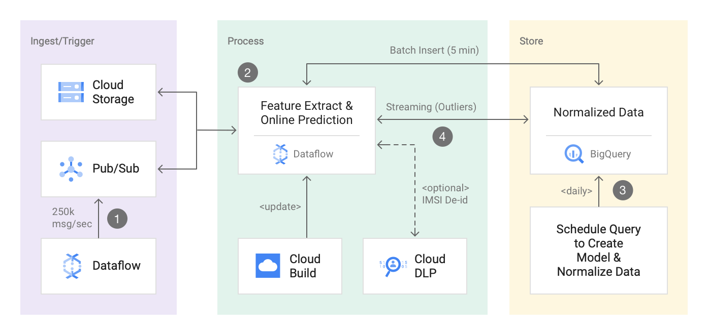

## Quick Start

[](https://console.cloud.google.com/cloudshell/editor?cloudshell_git_repo=https://github.com/GoogleCloudPlatform/df-ml-anomaly-detection.git)

### Enable APIs

```gcloud services enable bigquery
gcloud services enable storage_component
gcloud services enable dataflow
gcloud services enable cloudbuild.googleapis.com
gcloud config set project <project_id>
```
### Access to Cloud Build Service Account 

```export PROJECT_ID=$(gcloud config get-value project)
export PROJECT_NUMBER=$(gcloud projects list --filter=${PROJECT_ID} --format="value(PROJECT_NUMBER)") 
gcloud projects add-iam-policy-binding ${PROJECT_ID} --member serviceAccount:$PROJECT_NUMBER@cloudbuild.gserviceaccount.com --role roles/editor
gcloud projects add-iam-policy-binding ${PROJECT_ID} --member serviceAccount:$PROJECT_NUMBER@cloudbuild.gserviceaccount.com --role roles/storage.objectAdmin
```

#### Export Required Parameters 
```
export DATASET=<var>bq-dataset-name</var>
export SUBSCRIPTION_ID=<var>subscription_id</var>
export TOPIC_ID=<var>topic_id</var>
export DATA_STORAGE_BUCKET=${PROJECT_ID}-<var>data-storage-bucket</var>
```
You can also export DLP template and batch size to enable DLP transformation in the pipeline
* Batch Size is in bytes and max allowed is less than 520KB/payload
```
export DEID_TEMPLATE=projects/{id}/deidentifyTemplates/{template_id}
export BATCH_SIZE = 350000
```
#### Trigger Cloud Build Script

```
gcloud builds submit scripts/. --config scripts/cloud-build-demo.yaml  --substitutions \
_DATASET=$DATASET,\
_DATA_STORAGE_BUCKET=$DATA_STORAGE_BUCKET,\
_SUBSCRIPTION_ID=${SUBSCRIPTION_ID},\
_TOPIC_ID=${TOPIC_ID},\
_API_KEY=$(gcloud auth print-access-token)
```
#### (Optional) Trigger the pipelines using flex template
If you have all other resources like BigQuery tables, PubSub topic and subscriber, GCS bucket already exist or created before, you can use the command below to trigger the pipeline by using a public image. This may be helpful for run the pipeline for live demo. 

Generate 10k msg/sec of random net flow log data:
```
gcloud beta dataflow flex-template run data-generator --project=<project_id> --region=<region> --template-file-gcs-location=gs://df-ml-anomaly-detection-mock-data/dataflow-flex-template/dynamic_template_data_generator_template.json --parameters=autoscalingAlgorithm="NONE",numWorkers=5,maxNumWorkers=5,workerMachineType=n1-standard-4,qps=10000,schemaLocation=gs://df-ml-anomaly-detection-mock-data/schema/next-demo-schema.json,eventType=net-flow-log,topic=projects/<project_id>/topics/events
```
Generate 1k msg/sec of random outlier data:
```
gcloud beta dataflow flex-template run data-generator --project=<project_id> --region=<region> --template-file-gcs-location=gs://df-ml-anomaly-detection-mock-data/dataflow-flex-template/dynamic_template_data_generator_template.json --parameters=autoscalingAlgorithm="NONE",numWorkers=5,maxNumWorkers=5,workerMachineType=n1-standard-4,qps=1000,schemaLocation=gs://df-ml-anomaly-detection-mock-data/schema/next-demo-schema-outlier.json,eventType=net-flow-log,topic=projects/<project_id>/topics/<topic_id>
```

Trigger Anomaly Detection Pipeline:

```
gcloud beta dataflow flex-template run "anomaly-detection" --project=<project_id>--region=us-central1 --template-file-gcs-location=gs://df-ml-anomaly-detection-mock-data/dataflow-flex-template/dynamic_template_secure_log_aggr_template.json --parameters=autoscalingAlgorithm="NONE",numWorkers=20,maxNumWorkers=20,workerMachineType=n1-highmem-4,subscriberId=projects/<project_id>/subscriptions/events-sub,tableSpec=<project_id>:<dataset_name>.cluster_model_data,batchFrequency=10,customGcsTempLocation=gs://df-tmp-data/temp,tempLocation=gs://df-temp-data/temp,clusterQuery=gs://<path>/normalized_cluster_data.sql,outlierTableSpec=<project_id>:<dataset_name>.outlier_data,inputFilePattern=gs://df-ml-anomaly-detection-mock-data/flow_log*.json,enbaleStreamingEngine=true,windowInterval=5,writeMethod=FILE_LOADS,streaming=true

```
### Generate some mock data (1k events/sec) in PubSub topic
```
gradle run -DmainClass=com.google.solutions.df.log.aggregations.StreamingBenchmark \
 -Pargs="--streaming  --runner=DataflowRunner --project=${PROJECT_ID} --autoscalingAlgorithm=NONE --workerMachineType=n1-standard-4 --numWorkers=3 --maxNumWorkers=3 --qps=1000 --schemaLocation=gs://df-ml-anomaly-detection-mock-data/schema/netflow_log_json_schema.json  --eventType=netflow --topic=${TOPIC_ID} --region=us-central1"
```
### Publish an outlier with an unusal tx & rx bytes
```
gcloud pubsub topics publish events --message  "{\"subscriberId\": \"00000000000000000\", \
 \"srcIP\": \"12.0.9.4\", \
 \"dstIP\": \"12.0.1.3\", \
 \"srcPort\": 5000, \
 \"dstPort\": 3000, \
 \"txBytes\": 150000, \
 \"rxBytes\": 40000, \
 \"startTime\": 1570276550, \
 \"endTime\": 1570276550, \
 \"tcpFlag\": 0, \
 \"protocolName\": \"tcp\", \
 \"protocolNumber\": 0}"
```

### Clean up
Please stop/cancel the dataflow pipeline manually from the UI. 

##  Learn More About This Solution

### Example input log data and output after aggregation

Sample Input Data

```
{
 \"subscriberId\": \"100\",
 \"srcIP\": \"12.0.9.4",
 \"dstIP\": \"12.0.1.2\",
 \"srcPort\": 5000,
 \"dstPort\": 3000,
 \"txBytes\": 15,
 \"rxBytes\": 40,
 \"startTime\": 1570276550,
 \"endTime\": 1570276559,
 \"tcpFlag\": 0,
 \"protocolName\": \"tcp\",
 \"protocolNumber\": 0
}, 
{
\"subscriberId\": \"100\",
\"srcIP\": \"12.0.9.4\",
\"dstIP\": \"12.0.1.2\",
\"srcPort\": 5000,
\"dstPort\": 3000,
\"txBytes\": 10,
\"rxBytes\": 40,
\"startTime\": 1570276650,
\"endTime\": 11570276750,,
\"tcpFlag\": 0,
\"protocolName\": \"tcp\",
\"protocolNumber\": 0
}
```
### Feature Extraction After Aggregation

1. Added processing timestamp.
2. Group by destination subnet and subscriberId
3. Number of approximate unique IP 
4. Number of approximate unique port
5. Number of unique records
6. Max, min, avg txBytes
7. Max, min, avg rxBytes
8. Max, min, avg duration    

```
{
  "transaction_time": "2019-10-27 23:22:17.848000",
  "subscriber_id": "100",
  "dst_subnet": "12.0.1.2/22",
  "number_of_unique_ips": "1",
  "number_of_unique_ports": "1",
  "number_of_records": "2",
  "max_tx_bytes": "15",
  "min_tx_bytes": "10",
  "avg_tx_bytes": "12.5",
  "max_rx_bytes": "40",
  "min_rx_bytes": "40",
  "avg_rx_bytes": "40.0",
  "max_duration": "100",
  "min_duration": "9",
  "avg_duration": "54.5"
}
```

### Feature Extraction Using Beam Schema Inferring 
```.apply("Group By SubId & DestSubNet",
   Group.<Row>byFieldNames("subscriberId", "dstSubnet")
      .aggregateField(
         "srcIP",
            new ApproximateUnique.ApproximateUniqueCombineFn<String>(
                 SAMPLE_SIZE, StringUtf8Coder.of()),
                    "number_of_unique_ips")
      .aggregateField(
          "srcPort",
              new ApproximateUnique.ApproximateUniqueCombineFn<Integer>(
                  SAMPLE_SIZE, VarIntCoder.of()),
                    "number_of_unique_ports")
      .aggregateField("srcIP", Count.combineFn(), "number_of_records")
      .aggregateField("txBytes", new AvgCombineFn(), "avg_tx_bytes")
      .aggregateField("txBytes", Max.ofIntegers(), "max_tx_bytes")
      .aggregateField("txBytes", Min.ofIntegers(), "min_tx_bytes")
      .aggregateField("rxBytes", new AvgCombineFn(), "avg_rx_bytes")
      .aggregateField("rxBytes", Max.ofIntegers(), "max_rx_bytes")
      .aggregateField("rxBytes", Min.ofIntegers(), "min_rx_bytes")
      .aggregateField("duration",new AvgCombineFn(), "avg_duration")
      .aggregateField("duration", Max.ofIntegers(), "max_duration")
      .aggregateField("duration", Min.ofIntegers(), "min_duration"));
```

### Create a K-Means model using BQ ML 

Please use the json schema (aggr_log_table_schema.json) to create the table in BQ.
Cluster_model_data table is partition by 'ingestion timestamp' and clustered by dst_subnet and subscriber_id.

```--> train data select
CREATE or REPLACE TABLE network_logs.train_data as (select * from {dataset_name}.cluster_model_data 
where _PARTITIONDATE between 'date_from' AND 'date_to';
--> create model
CREATE OR REPLACE {dataset_name}.log_cluster  options(model_type='kmeans', num_clusters=4, standardize_features = true) 
AS select * except (transaction_time, subscriber_id, number_of_unique_ips, number_of_unique_ports, dst_subnet) 
from network_logs.train_data;
```

### Normalize Data using BQ Store Procedure

1. Predict on the train dataset to get the nearest distance from centroid for each record.
2. Calculate the STD DEV for each point to normalize
3. Store them in a table dataflow pipeline can use as side input  

```CREATE or REPLACE table {dataset_name}.normalized_centroid_data AS(
with centroid_details AS (
select centroid_id,array_agg(struct(feature as name, round(numerical_value,1) as value) order by centroid_id) AS cluster
from ML.CENTROIDS(model network_logs.log_cluster_2)
group by centroid_id),
cluster as (select centroid_details.centroid_id as centroid_id,
(select value from unnest(cluster) where name = 'number_of_records') AS number_of_records,
(select value from unnest(cluster) where name = 'max_tx_bytes') AS max_tx_bytes,
(select value from unnest(cluster) where name = 'min_tx_bytes') AS min_tx_bytes,
(select value from unnest(cluster) where name = 'avg_tx_bytes') AS avg_tx_bytes,
(select value from unnest(cluster) where name = 'max_rx_bytes') AS max_rx_bytes,
(select value from unnest(cluster) where name = 'min_rx_bytes') AS min_rx_bytes,
(select value from unnest(cluster) where name = 'avg_rx_bytes') AS avg_rx_bytes,
(select value from unnest(cluster) where name = 'max_duration') AS max_duration,
(select value from unnest(cluster) where name = 'min_duration') AS min_duration,
(select value from unnest(cluster) where name = 'avg_duration') AS avg_duration
from centroid_details order by centroid_id asc),
predict as (select * from ML.PREDICT(model {dataset_name}.log_cluster_2, (select * from network_logs.train_data)))
select c.centroid_id as centroid_id, 
(stddev((p.number_of_records-c.number_of_records)
+(p.max_tx_bytes-c.max_tx_bytes)
+(p.min_tx_bytes-c.min_tx_bytes)
+(p.avg_tx_bytes-c.min_tx_bytes)
+(p.max_rx_bytes-c.max_rx_bytes)
+(p.min_rx_bytes-c.min_rx_bytes)
+(p.avg_rx_bytes-c.min_rx_bytes)
+(p.max_duration-c.max_duration)
+(p.min_duration-c.min_duration)
+(p.avg_duration-c.avg_duration)))as normalized_dest, 
any_value(c.number_of_records) as number_of_records,
any_value(c.max_tx_bytes) as max_tx_bytes,
any_value(c.min_tx_bytes) as min_tx_bytes ,
any_value(c.avg_tx_bytes) as avg_tx_bytes,
any_value(c.max_rx_bytes) as max_rx_bytes, 
any_value(c.min_tx_bytes) as min_rx_bytes, 
any_value(c.avg_rx_bytes) as avg_rx_bytes,  
any_value(c.avg_duration) as avg_duration,
any_value(c.max_duration) as max_duration, 
any_value(c.min_duration) as min_duration
from predict as p 
inner join cluster as c on c.centroid_id = p.centroid_id
group by c.centroid_id);
```


### Find the Outliers

1. Find the nearest distance from the centroid.  
2. Calculate STD DEV between input and centroid vectors 
3. Find the Z Score (difference between a value in the sample and the mean, and divide it by the standard deviation)
4. A score of 2 (2 STD DEV above the mean is an OUTLIER). 

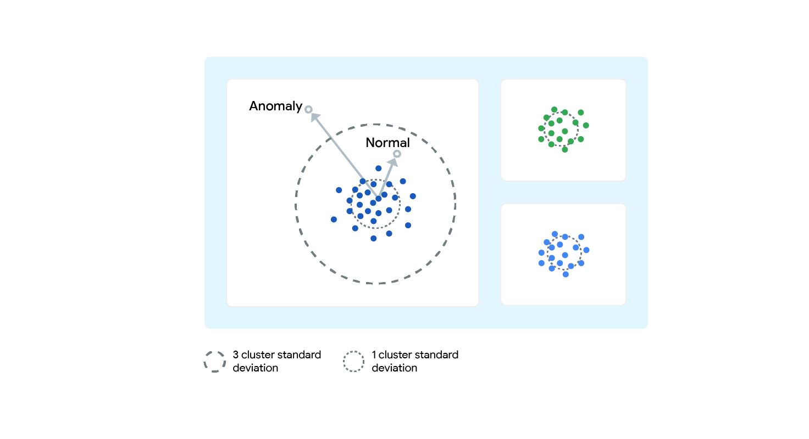

## Before Start (Optional Step if Cloud Build Script is NOT used)

````
gcloud services enable dataflow
gcloud services enable big query
gcloud services enable storage_component
````

## Creating a BigQuery Dataset and Tables

Dataset

```
bq --location=US mk -d \ 
--description "Network Logs Dataset \ 
<dataset_name>
```

Aggregation Data Table 

```
bq mk -t --schema aggr_log_table_schema.json  \
--time_partitioning_type=DAY \
--clustering_fields=dst_subnet, subscriber_id \
--description "Network Log Partition Table" \
--label myorg:prod \
<project>:<dataset_name>.cluster_model_data 
```

Outlier Table 

```
bq mk -t --schema outlier_table_schema.json \
--label myorg:prod \
<project>:<dataset_name>.network_logs.outlier_data 
```

## Build & Run
To Build 

```
gradle spotlessApply -DmainClass=com.google.solutions.df.log.aggregations.SecureLogAggregationPipeline 
gradle build -DmainClass=com.google.solutions.df.log.aggregations.SecureLogAggregationPipeline 

gcloud auth configure-docker
gradle jib --image=gcr.io/${PROJECT_ID}/df-ml-anomaly-detection:latest -DmainClass=com.google.solutions.df.log.aggregations.SecureLogAggregationPipeline

```

To Run  

```
gcloud beta dataflow flex-template run "anomaly-detection" \
--project=${PROJECT_ID} \
--region=us-central1 \
--template-file-gcs-location=gs://${DF_TEMPLATE_CONFIG_BUCKET}/dynamic_template_secure_log_aggr_template.json \
--parameters=autoscalingAlgorithm="NONE",\
numWorkers=5,\
maxNumWorkers=5,\
workerMachineType=n1-highmem-4,\
subscriberId=projects/${PROJECT_ID}/subscriptions/${SUBSCRIPTION_ID},\
tableSpec=${PROJECT_ID}:${DATASET_NAME}.cluster_model_data,\
batchFrequency=2,\
customGcsTempLocation=gs://${DF_TEMPLATE_CONFIG_BUCKET}/temp,\
tempLocation=gs://${DF_TEMPLATE_CONFIG_BUCKET}/temp,\
clusterQuery=gs://${DF_TEMPLATE_CONFIG_BUCKET}/normalized_cluster_data.sql,\
outlierTableSpec=${PROJECT_ID}:${DATASET_NAME}.outlier_data,\
inputFilePattern=gs://df-ml-anomaly-detection-mock-data/flow_log*.json,\
workerDiskType=compute.googleapis.com/projects/${PROJECT_ID}/zones/us-central1-b/diskTypes/pd-ssd,\
diskSizeGb=5,\
windowInterval=10,\
writeMethod=FILE_LOADS,\
streaming=true

```

## Test 

Publish mock log data at 250k msg/sec

Schema used for load test: 

```
{
 "subscriberId": "{{long(1111111111,9999999999)}}",
 "srcIP": "{{ipv4()}}",
 "dstIP": "{{subnet()}}",
 "srcPort": {{integer(1000,5000)}},
 "dstPort": {{integer(1000,5000)}},
 "txBytes": {{integer(10,1000)}},
 "rxBytes": {{integer(10,1000)}},
 "startTime": {{starttime()}},
 "endTime": {{endtime()}},
 "tcpFlag": {{integer(0,65)}},
 "protocolName": "{{random("tcp","udp","http")}}",
 "protocolNumber": {{integer(0,1)}}
}
```

To Run: 

```
export PROJECT_ID=$(gcloud config get-value project)
export TOPIC_ID=<var>topic-id</var>
gcloud pubsub topics create $TOPIC_ID
gcloud builds submit . --machine-type=n1-highcpu-8 --config scripts/cloud-build-data-generator.yaml  --substitutions _TOPIC_ID=${TOPIC_ID}
``` 

Outlier Test 
```
gcloud pubsub topics publish <topic_id> \
 --message "{\"subscriberId\": \"demo1\",\"srcIP\": \"12.0.9.4\",\"dstIP\": \"12.0.1.3\",\"srcPort\": 5000,\"dstPort\": 3000,\"txBytes\": 150000,\"rxBytes\": 40000,\"startTime\": 1570276550,\"endTime\": 1570276550,\"tcpFlag\": 0,\"protocolName\": \"tcp\",\"protocolNumber\": 0}"
 
gcloud pubsub topics publish <topic_id> \
 --message "{\"subscriberId\": \"demo1\",\"srcIP\": \"12.0.9.4\",\"dstIP\": \"12.0.1.3\",\"srcPort\": 5000,\"dstPort\": 3000,\"txBytes\": 15000000,\"rxBytes\": 4000000,\"startTime\": 1570276550,\"endTime\": 1570276550,\"tcpFlag\": 0,\"protocolName\": \"tcp\",\"protocolNumber\": 0}"
```

Feature Extraction Test

```
gcloud pubsub topics publish <topic_id> \
--message "{\"subscriberId\": \"100\",\"srcIP\": \"12.0.9.4\",\"dstIP\": \"12.0.1.2\",\"srcPort\": 5000,\"dstPort\": 3000,\"txBytes\": 10,\"rxBytes\": 40,\"startTime\": 1570276550,\"endTime\": 1570276559,\"tcpFlag\": 0,\"protocolName\": \"tcp\",\"protocolNumber\": 0}"
gcloud pubsub topics publish <topic_id> \
--message "{\"subscriberId\": \"100\",\"srcIP\": \"13.0.9.4\",\"dstIP\": \"12.0.1.2\",\"srcPort\": 5001,\"dstPort\": 3000,\"txBytes\": 15,\"rxBytes\": 40,\"startTime\": 1570276650,\"endTime\": 1570276750,\"tcpFlag\": 0,\"protocolName\": \"tcp\",\"protocolNumber\": 0}"
OUTPUT: INFO: row value Row:[2, 2, 2, 12.5, 15, 10, 50]
```

```
gcloud pubsub topics publish <topic_id>  \
--message "{\"subscriberId\": \"100\",\"srcIP\": \"12.0.9.4\",\"dstIP\": \"12.0.1.2\",\"srcPort\": 5000,\"dstPort\": 3000,\"txBytes\": 10,\"rxBytes\": 40,\"startTime\": 1570276550,\"endTime\": 1570276550,\"tcpFlag\": 0,\"protocolName\": \"tcp\",\"protocolNumber\": 0}"

gcloud pubsub topics publish <topic_id> \
--message "{\"subscriberId\": \"100\",\"srcIP\": \"12.0.9.4\",\"dstIP\": \"12.0.1.2\",\"srcPort\": 5000,\"dstPort\": 3000,\"txBytes\": 15,\"rxBytes\": 40,\"startTime\": 1570276550,\"endTime\": 1570276550,\"tcpFlag\": 0,\"protocolName\": \"tcp\",\"protocolNumber\": 0}"
OUTPUT INFO: row value Row:[1, 1, 2, 12.5, 15, 10, 0]
```
## Pipeline Performance at 250k msg/sec

Pipeline DAG (ToDo: change with updated pipeline DAG)

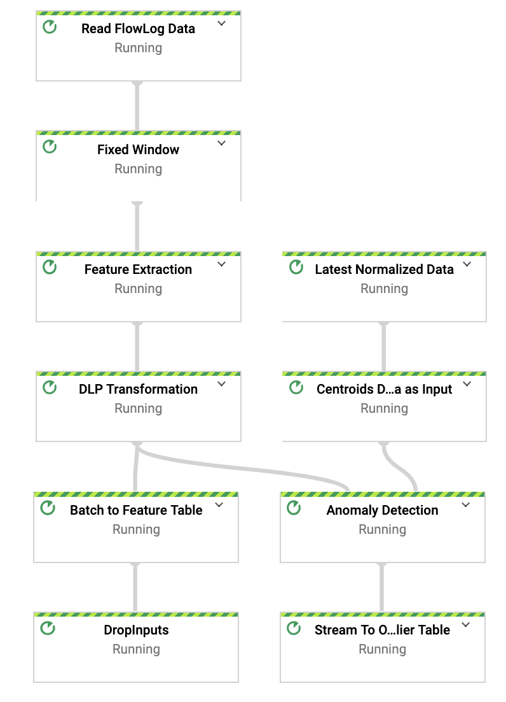


Msg Rate


Ack Message Rate


CPU Utilization


System Latency 

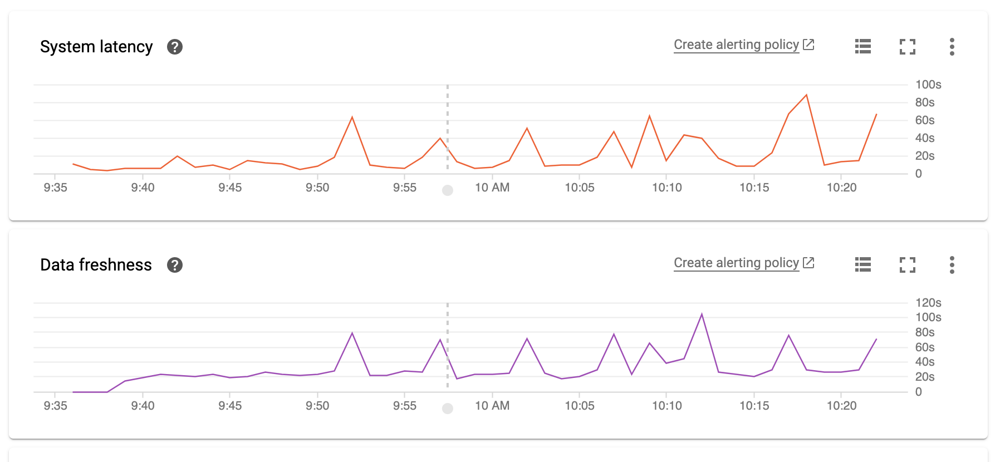

### K-Means Clustering Using BQ-ML (Model Evaluation)


 
### DLP Integration

To protect any sensitive data in the log,  you can use Cloud DLP to inspect, de-identify before data is stored in BigQuery. This is an optional integration in our reference architecture. To enable, please follow the steps below:

*  Update the JSON file at scripts/deid_imei_number.json to add the de-identification transformation applicable for your use case. Screen shot below used a crypto based  deterministic transformation to de-identify IMSI number.  To understand how DLP transformation can be used, please refer to this [guide](https://cloud.google.com/solutions/de-identification-re-identification-pii-using-cloud-dlp).  

```
{
   "deidentifyTemplate":{
      "displayName":"Config to DeIdentify IMEI Number",
      "description":"IMEI Number masking transformation",
      "deidentifyConfig":{
         "recordTransformations":{
            "fieldTransformations":[
               {
                  "fields":[
                     {
                        "name":"subscriber_id"
                     }
                  ],
                  "primitiveTransformation":{
                     "cryptoDeterministicConfig":{
                        "cryptoKey":{
                         	<add _dlp_transformation_config>
                           }
                        },
                        "surrogateInfoType":{
                           "name":"IMSI_TOKEN"
                        }
                     }
                  }
               }
            ]
         }
      }
   },
   "templateId":"dlp-deid-subid"
}
```

*  Run this script (deid_template.sh) to create a template in your project.  

```set -x 
PROJECT_ID=$(gcloud config get-value project)
DEID_CONFIG="@deid_imei_number.json"
DEID_TEMPLATE_OUTPUT="deid-template.json"
API_KEY=$(gcloud auth print-access-token)
API_ROOT_URL="https://dlp.googleapis.com"
DEID_TEMPLATE_API="${API_ROOT_URL}/v2/projects/${PROJECT_ID}/deidentifyTemplates"
curl -X POST -H "Content-Type: application/json" \
 -H "Authorization: Bearer ${API_KEY}" \
 "${DEID_TEMPLATE_API}"`` \
 -d "${DEID_CONFIG}"\
 -o "${DEID_TEMPLATE_OUTPUT}"  
 ```

*  Pass the DLP template name Dataflow pipeline. 

```export DEID_TEMPLATE_NAME=$(jq -r '.name' deid-template.json);echo $DEID_TEMPLATE_NAME
--deidTemplateName=projects/<project_id>/deidentifyTemplates/dlp-deid-subid"
```

Note: Please checkout this [repo](https://github.com/GoogleCloudPlatform/dlp-dataflow-deidentification) to learn more about a end to end data tokenization solution. 


If you click on DLP Transformation from the DAG, you will see following sub transforms:

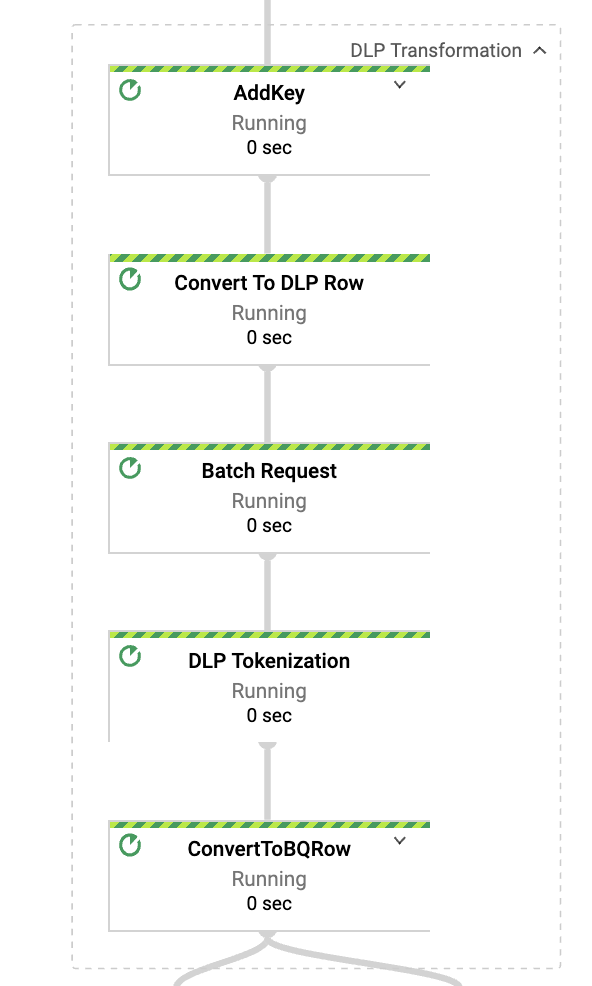


### Looker Integration
Addition to feature and outlier tables, you can  also include raw netflow log data in a BigQuery table. This includes geo location data like country, city, latitude, longitude derived from the simulated IP.  Pipeline uses (MaxMind-GeoIP2 Java API)[https://maxmind.github.io/GeoIP2-java/]. 
#### Create a table to store raw log netflow data 

```
bq mk -t --schema src/main/resources/netflow_log_raw_datat.json \
--time_partitioning_type=DAY \
--clustering_fields="geoCountry,geoCity" \
--description "Raw Netflow Log Data" \
${PROJECT_ID}:${DATASET_NAME}.netflow_log_data

```

####
Pass the parameter in the pipeline. If not passed, pipeline assumes no need to store raw log data. Feature and outlier data will be stored as expected.

```
--logTableSpec=<project_id>:<dataset>.netflow_log_data
```


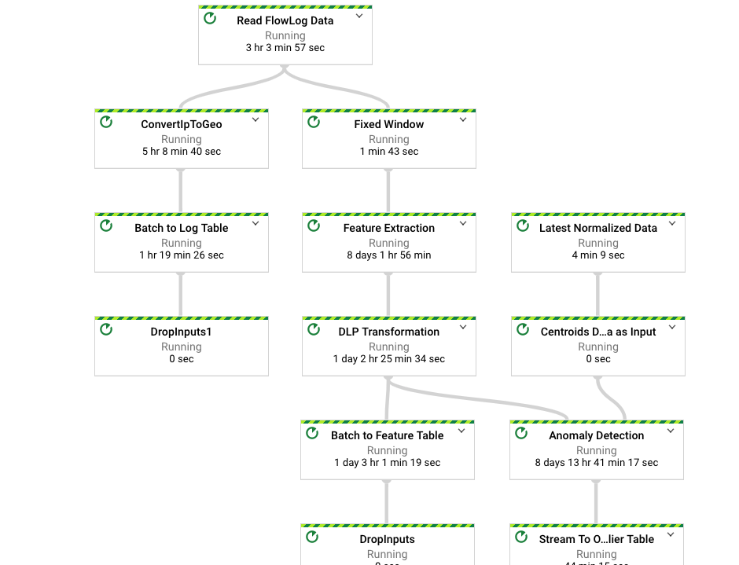


## Anomaly Detection in Financial Transactions
This section of this repo contains a reference implementation of finding fraudulent transactions using Dataflow and Cloud AI. First step is to create a TensorFlow  boosted tree model  by using a [Kaggle dataset](https://www.kaggle.com/ntnu-testimon/paysim1) and deploy the model in Cloud AI for online prediction. Then uses a Dataflow pipeline highlighted in the reference architecture below to micro batch the request for online prediction.  Finally, the transaction data is stored in a BigQuery table called transactions and outlier data is stored in a table called fraud_prediction. Data can be joined between two tables  by transactionId column.  By default, probability is set to 0.99 (99%) to identify the fraudulent transactions. 

## Anomaly Detection Reference Architecture Using Cloud AI
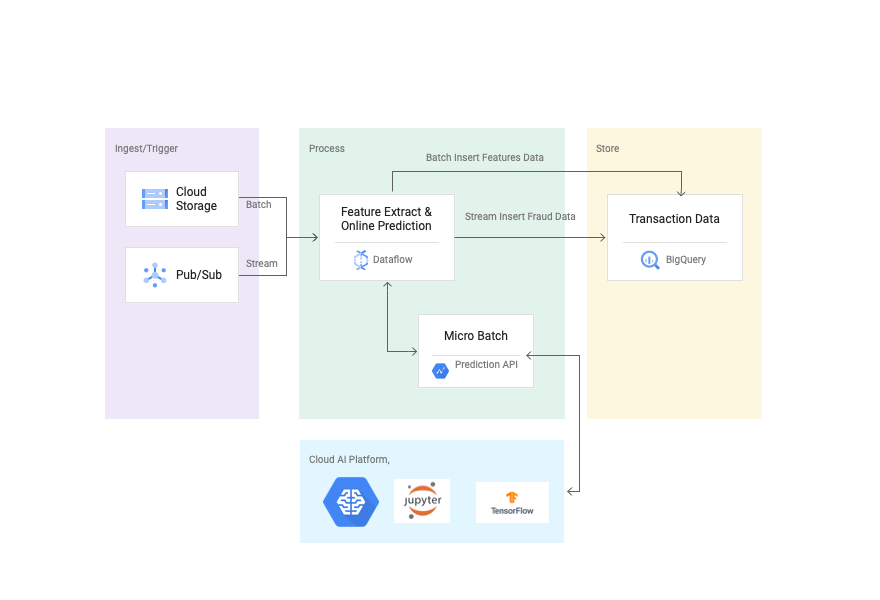


## Trigger the pipeline using Flex Template
You can use the command below to trigger the pipeline using a public image as a Dataflow flex template

```
gcloud beta dataflow flex-template run "anomaly-detection-finserv" --project=<project> --region=<region> --template-file-gcs-location=gs://df-ml-anomaly-detection-mock-data/dataflow-flex-template/dynamic_template_finserv_fraud_detection.json --parameters=autoscalingAlgorithm="NONE",numWorkers=30,maxNumWorkers=30,workerMachineType=n1-highmem-8,subscriberId=projects/<id>/subscriptions/<id>,tableSpec=project:dataset.transactions,outlierTableSpec=project:dataset.fraud_prediction,tempLocation=gs://<bucket>/temp,inputFilePattern=gs://df-ml-anomaly-detection-mock-data/finserv_fraud_detection/fraud_data_kaggle.json,modelId=<id>,versionId=<id>,keyRange=1024,batchSize=500000
```
## Build & Run

1. Please follow this [code lab](https://codelabs.developers.google.com/codelabs/fraud-detection-ai-explanations/#7) to build and deploy the [TensorFlow model](https://www.tensorflow.org/api_docs/python/tf/estimator/BoostedTreesClassifier) in Cloud AI.  Also, notice the change in the notebook to add a transactionId as part of serving function. Updated notebook can be found [here](https://github.com/GoogleCloudPlatform/df-ml-anomaly-detection/blob/finserv-fraud-detection-tf-cloud-ai/fraud-detection-notebook/credit-card-fraud-detection-v1.ipynb).  

2. Use the command below to create a Dataset and two tables in BigQuery.  

```
bq --location=US mk -d \ 
--description "FinServ Transaction Dataset \ 
<dataset_name>
``` 

```
bq mk -t --schema src/main/resources/transactions.json \
--label myorg:prod \
<project>:<dataset_name>.transactions 
```

```
bq mk -t --schema src/main/resources/fraud_prediction.json \
--label myorg:prod \
<project>:<dataset_name>.fraud_prediction
```

3. Trigger the Dataflow pipeline by passing all required parameters.  Pipeline uses state and timer api to micro batch the call to prediction API.

```
gradle run -DmainClass=com.google.solutions.df.log.aggregations.FraudDetectionFinServTranPipeline -Pargs="--runner=DataflowRunner --project=<prroject-id>> \
--inputFilePattern=gs://df-ml-anomaly-detection-mock-data/finserv_fraud_detection/fraud_data_kaggle.json \
--subscriberId=projects/<project-id>/subscriptions/<subs_id> \
--modelId=<model_id> \
--versionId=<version_id> \
--outlierTableSpec=<project_id>:<dataset>.fraud_prediction \
--tableSpec=<project_id>:<dataset>.transactions \
--keyRange=1024 \
--autoscalingAlgorithm=NONE \
--numWorkers=30 \
--maxNumWorkers=30 \
--workerMachineType=n1-highmem-8 \
--batchSize=500000 \
--region=us-central1 \
--gcpTempLocation=gs://df-temp-data/temp"

```
## Test
1. Reading the full kaggle dataset (6M+) form GCS bucket and publish  some random mock data in PubSub topic
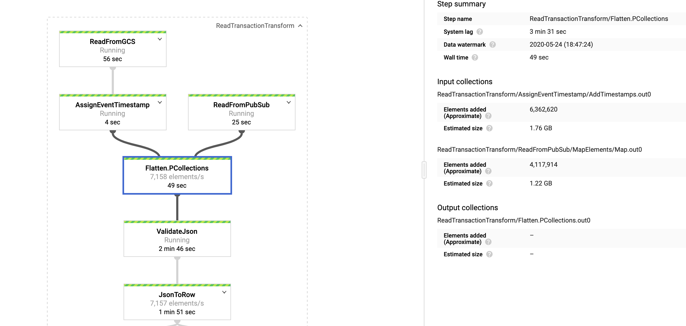. 

Full DAG
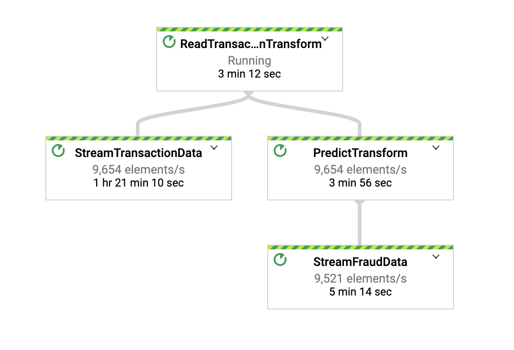. 

2. Predict Transform with 500KB payload / request

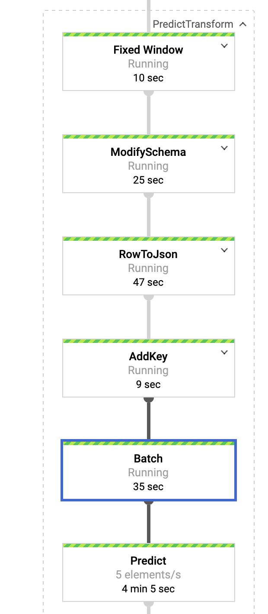. 

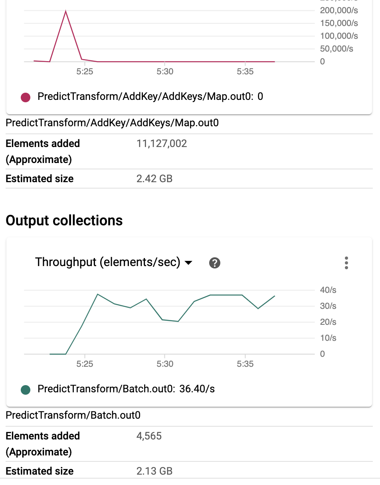. 

3. BigQuery validation
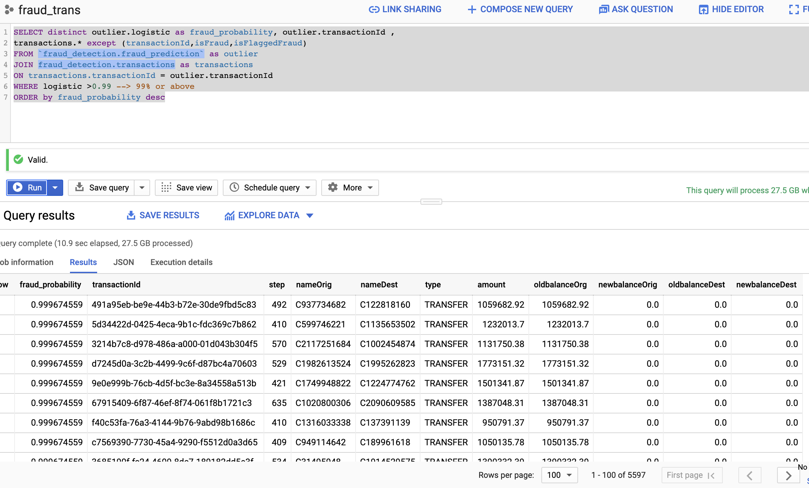. 

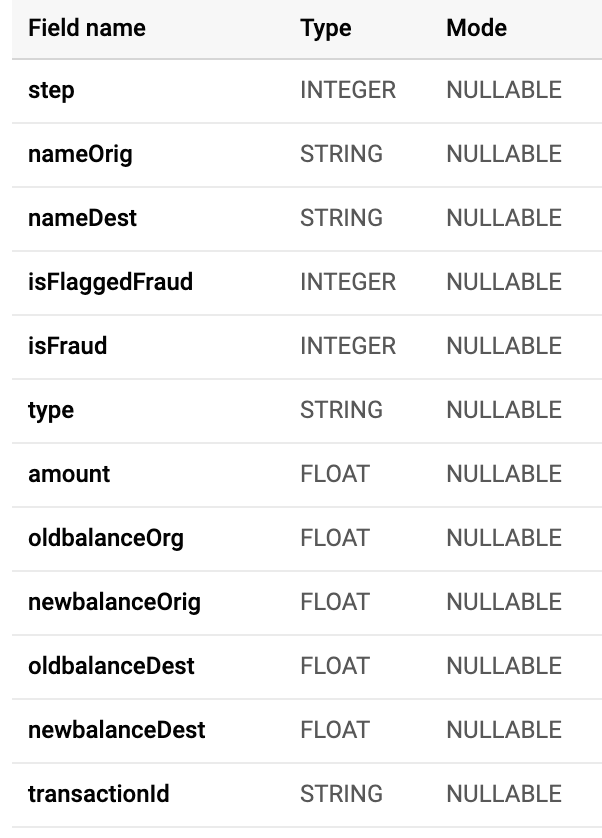. 

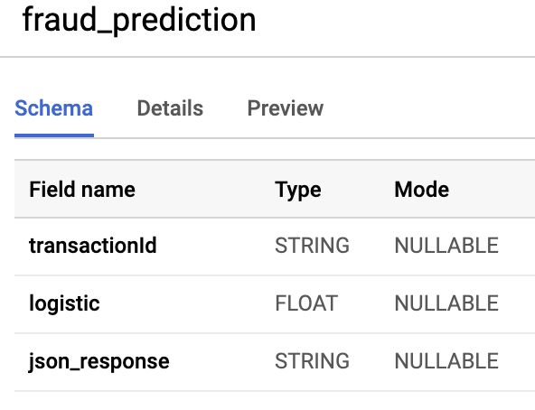. 

4. Prediction API in Cloud AI
. 

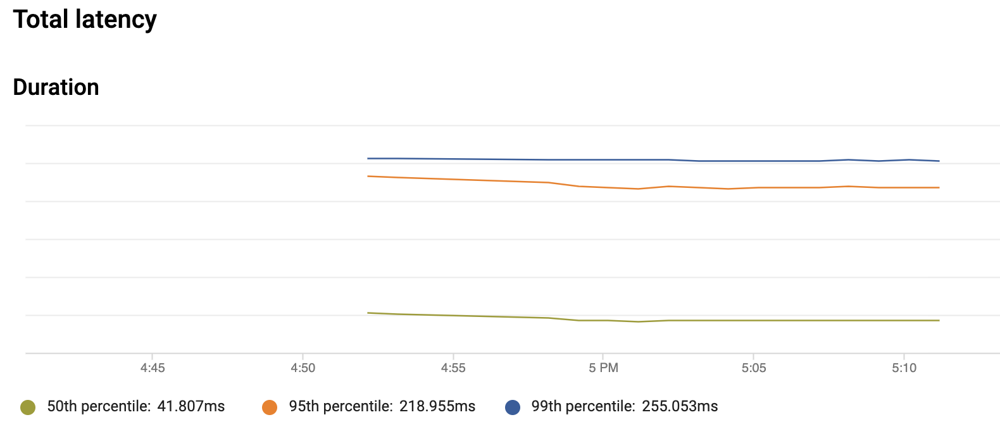. 

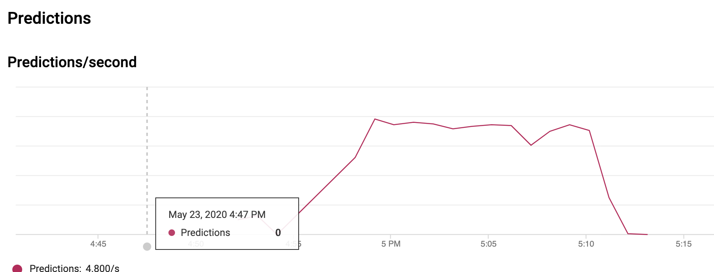. 

4. Custom Counter in Dataflow UI

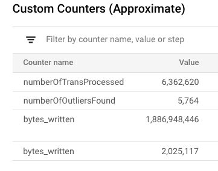. 


 


