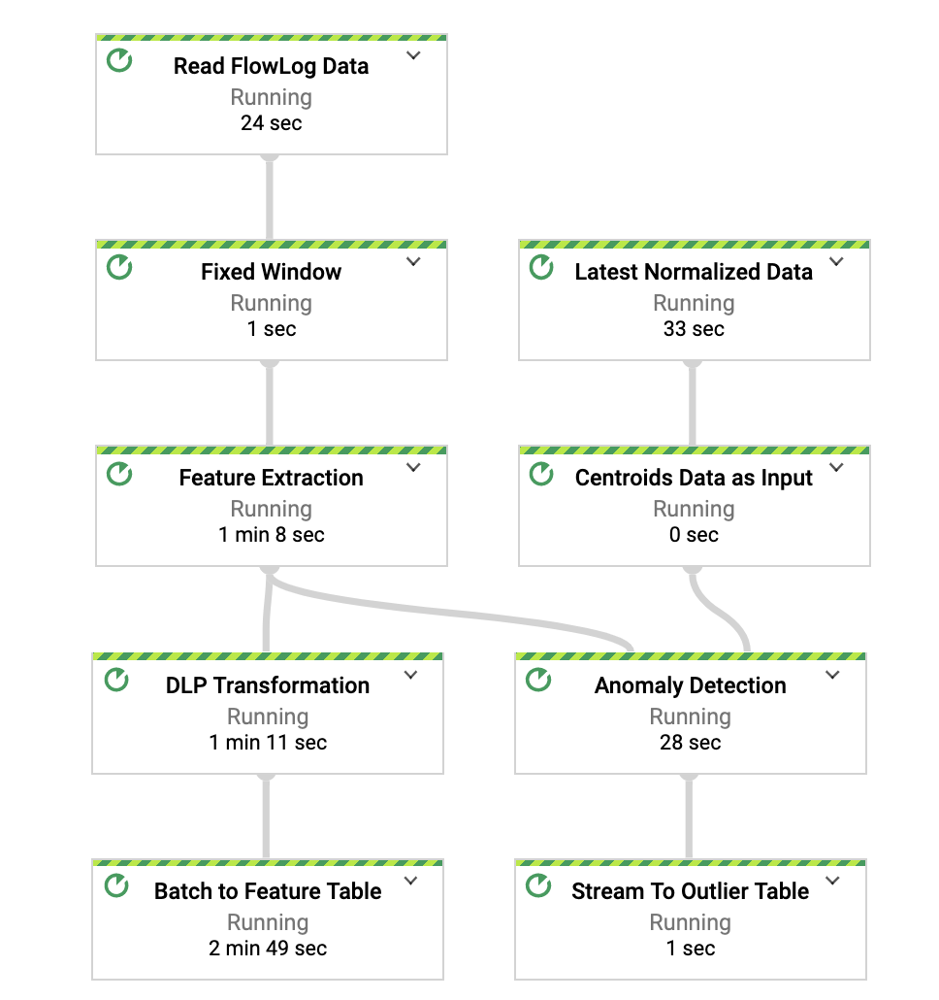
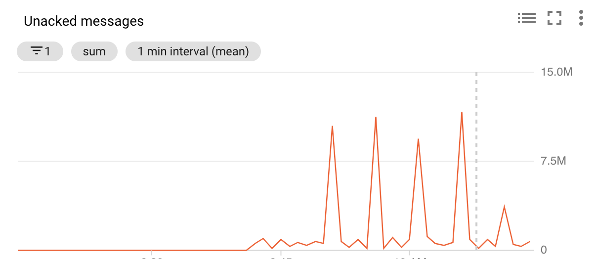
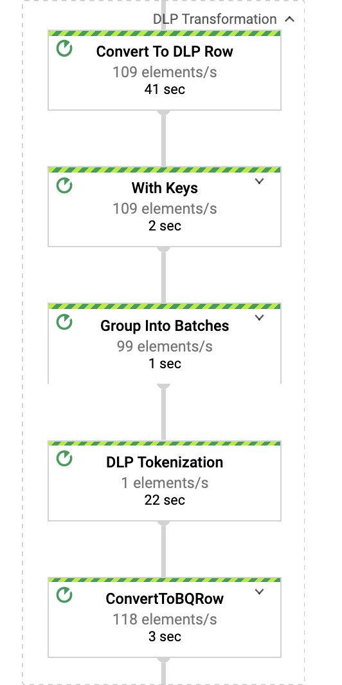

#  ML based Network Anomaly Detection solution to identify Cyber Security Threat
This repo contains a reference implementation of  a ML based Network Anomaly Detection solution by using Pub/Sub, Dataflow, BQML and CLoud DLP.  Solution uses built in K-Means clustering model in  BQML to train and normalize netflow log data.  Dataflow for feature extraction & real time outlier detection and  uses Cloud DLP to crypto tokenize IMSI  (international mobile subscriber identity) as millions of netflow log ingested from PubSub or GCS.  

## Table of Contents  
* [Summary](#summary)  
* [Reference Architecture](#reference-architecture).      
* [Quick Start](#quick-start).  
* [Learn More](#learn-more-about-this-solution)
	* [Mock Data Generator to Pub/Sub Using Dataflow](#test)
	* [Train & Normalize Data Using BQ ML](#create-a-k-means-model-using-bq-ml )  
	* [Feature Extraction Using Dataflow](#feature-extraction-after-aggregation)
	* [Realtime outlier detection using Dataflow](#find-the-outliers) 
	* [Sensitive data (IMSI) de-identification using CLoud DLP](#dlp-itegration)
	
	 


## Summary
Securing its internal network from malware and security threats is critical at many customers. With the ever changing malware landscape and explosion of activities in IoT and M2M, existing signature based solutions for malware detection are no longer sufficient. This PoC highlights a ML based network anomaly detection solution using PubSub, Dataflow, BQ ML and DLP to detect mobile malware on subscriber devices and suspicious behaviour in wireless networks.

This solution implements the reference architecture highlighted below. You will execute a <b>dataflow streaming pipeline</b> to process netflow log from GCS and/or PubSub to find outliers in netflow logs  in real time.  This solution also uses a built in K-Means Clustering Model created by using <b>BQ-ML</b>.   

In summary, you can use this solution to demo following 3 use cases :

1.  Streaming Analytics at Scale by using Dataflow/Beam. (Feature Extraction & Online Prediction).  
2. Making Machine Learning easy to do by creating a model by using BQ ML K-Means Clustering.  
3. Protecting sensitive information e.g:"IMSI (international mobile subscriber identity)" by using Cloud DLP crypto based tokenization.  

## Reference Architecture


## Quick Start

[](https://console.cloud.google.com/cloudshell/editor?cloudshell_git_repo=https://github.com/GoogleCloudPlatform/df-ml-anomaly-detection.git)

### Enable APIs

```gcloud services enable bigquery
gcloud services enable storage_component
gcloud services enable dataflow
gcloud services enable cloudbuild.googleapis.com
gcloud config set project <project_id>
```
### Access to Cloud Build Service Account 

```export PROJECT_ID=$(gcloud config get-value project)
export PROJECT_NUMBER=$(gcloud projects list --filter=${PROJECT_ID} --format="value(PROJECT_NUMBER)") 
gcloud projects add-iam-policy-binding ${PROJECT_ID} --member serviceAccount:$PROJECT_NUMBER@cloudbuild.gserviceaccount.com --role roles/editor
gcloud projects add-iam-policy-binding ${PROJECT_ID} --member serviceAccount:$PROJECT_NUMBER@cloudbuild.gserviceaccount.com --role roles/storage.objectAdmin
```

#### Export Required Parameters 
```
export DATASET=<var>bq-dataset-name</var>
export SUBSCRIPTION_ID=<var>subscription_id</var>
export TOPIC_ID=<var>topic_id</var>
export DATA_STORAGE_BUCKET=${PROJECT_ID}-<var>data-storage-bucket</var>
```

#### Trigger Cloud Build Script

```
gcloud builds submit scripts/. --config scripts/cloud-build-demo.yaml  --substitutions \
_DATASET=$DATASET, \
_DATA_STORAGE_BUCKET=$DATA_STORAGE_BUCKET, \
_SUBSCRIPTION_ID=${SUBSCRIPTION_ID}, \
_TOPIC_ID=${TOPIC_ID} , \ 
_API_KEY=$(gcloud auth print-access-token)
```

### Generate some mock data (1k events/sec) in PubSub topic
```
gradle run -DmainClass=com.google.solutions.df.log.aggregations.StreamingBenchmark \
 -Pargs="--streaming  --runner=DataflowRunner --project=${PROJECT_ID} --autoscalingAlgorithm=NONE --workerMachineType=n1-standard-4 --numWorkers=3 --maxNumWorkers=3 --qps=1000 --schemaLocation=gs://df-ml-anomaly-detection-mock-data/schema/netflow_log_json_schema.json  --eventType=netflow --topic=${TOPIC_ID} --region=us-central1"
```
### Publish an outlier with an unusal tx & rx bytes
```
gcloud pubsub topics publish ${TOPIC_ID} --message "{\"subscriberId\": \"my-customer-demo\",\"srcIP\": \"12.0.9.4\",\"dstIP\": \"12.0.1.3\",\"srcPort\": 5000,\"dstPort\": 3000,\"txBytes\": 15000000,\"rxBytes\": 4000000,\"startTime\": 1570276550,\"endTime\": 1570276550,\"tcpFlag\": 0,\"protocolName\": \"tcp\",\"protocolNumber\": 0}"
```

### Clean up
Please stop/cancel the dataflow pipeline manually from the UI. 

##  Learn More About This Solution

### Example input log data and output after aggregation

Sample Input Data

```
{
 \"subscriberId\": \"100\",
 \"srcIP\": \"12.0.9.4",
 \"dstIP\": \"12.0.1.2\",
 \"srcPort\": 5000,
 \"dstPort\": 3000,
 \"txBytes\": 15,
 \"rxBytes\": 40,
 \"startTime\": 1570276550,
 \"endTime\": 1570276559,
 \"tcpFlag\": 0,
 \"protocolName\": \"tcp\",
 \"protocolNumber\": 0
}, 
{
\"subscriberId\": \"100\",
\"srcIP\": \"12.0.9.4\",
\"dstIP\": \"12.0.1.2\",
\"srcPort\": 5000,
\"dstPort\": 3000,
\"txBytes\": 10,
\"rxBytes\": 40,
\"startTime\": 1570276650,
\"endTime\": 11570276750,,
\"tcpFlag\": 0,
\"protocolName\": \"tcp\",
\"protocolNumber\": 0
}
```
### Feature Extraction After Aggregation

1. Added processing timestamp.
2. Group by destination subnet and subscriberId
3. Number of approximate unique IP 
4. Number of approximate unique port
5. Number of unique records
6. Max, min, avg txBytes
7. Max, min, avg rxBytes
8. Max, min, avg duration    

```
{
  "transaction_time": "2019-10-27 23:22:17.848000",
  "subscriber_id": "100",
  "dst_subnet": "12.0.1.2/22",
  "number_of_unique_ips": "1",
  "number_of_unique_ports": "1",
  "number_of_records": "2",
  "max_tx_bytes": "15",
  "min_tx_bytes": "10",
  "avg_tx_bytes": "12.5",
  "max_rx_bytes": "40",
  "min_rx_bytes": "40",
  "avg_rx_bytes": "40.0",
  "max_duration": "100",
  "min_duration": "9",
  "avg_duration": "54.5"
}
```

### Feature Extraction Using Beam Schema Inferring 
```.apply("Group By SubId & DestSubNet",
   Group.<Row>byFieldNames("subscriberId", "dstSubnet")
      .aggregateField(
         "srcIP",
            new ApproximateUnique.ApproximateUniqueCombineFn<String>(
                 SAMPLE_SIZE, StringUtf8Coder.of()),
                    "number_of_unique_ips")
      .aggregateField(
          "srcPort",
              new ApproximateUnique.ApproximateUniqueCombineFn<Integer>(
                  SAMPLE_SIZE, VarIntCoder.of()),
                    "number_of_unique_ports")
      .aggregateField("srcIP", Count.combineFn(), "number_of_records")
      .aggregateField("txBytes", new AvgCombineFn(), "avg_tx_bytes")
      .aggregateField("txBytes", Max.ofIntegers(), "max_tx_bytes")
      .aggregateField("txBytes", Min.ofIntegers(), "min_tx_bytes")
      .aggregateField("rxBytes", new AvgCombineFn(), "avg_rx_bytes")
      .aggregateField("rxBytes", Max.ofIntegers(), "max_rx_bytes")
      .aggregateField("rxBytes", Min.ofIntegers(), "min_rx_bytes")
      .aggregateField("duration",new AvgCombineFn(), "avg_duration")
      .aggregateField("duration", Max.ofIntegers(), "max_duration")
      .aggregateField("duration", Min.ofIntegers(), "min_duration"));
```

### Create a K-Means model using BQ ML 

Please use the json schema (aggr_log_table_schema.json) to create the table in BQ.
Cluster_model_data table is partition by 'ingestion timestamp' and clustered by dst_subnet and subscriber_id.

```--> train data select
CREATE or REPLACE TABLE network_logs.train_data as (select * from {dataset_name}.cluster_model_data 
where _PARTITIONDATE between 'date_from' AND 'date_to';
--> create model
CREATE OR REPLACE {dataset_name}.log_cluster  options(model_type='kmeans', num_clusters=4, standardize_features = true) 
AS select * except (transaction_time, subscriber_id, number_of_unique_ips, number_of_unique_ports, dst_subnet) 
from network_logs.train_data;
```

### Normalize Data using BQ Store Procedure

1. Predict on the train dataset to get the nearest distance from centroid for each record.
2. Calculate the STD DEV for each point to normalize
3. Store them in a table dataflow pipeline can use as side input  

```CREATE or REPLACE table {dataset_name}.normalized_centroid_data AS(
with centroid_details AS (
select centroid_id,array_agg(struct(feature as name, round(numerical_value,1) as value) order by centroid_id) AS cluster
from ML.CENTROIDS(model network_logs.log_cluster_2)
group by centroid_id),
cluster as (select centroid_details.centroid_id as centroid_id,
(select value from unnest(cluster) where name = 'number_of_records') AS number_of_records,
(select value from unnest(cluster) where name = 'max_tx_bytes') AS max_tx_bytes,
(select value from unnest(cluster) where name = 'min_tx_bytes') AS min_tx_bytes,
(select value from unnest(cluster) where name = 'avg_tx_bytes') AS avg_tx_bytes,
(select value from unnest(cluster) where name = 'max_rx_bytes') AS max_rx_bytes,
(select value from unnest(cluster) where name = 'min_rx_bytes') AS min_rx_bytes,
(select value from unnest(cluster) where name = 'avg_rx_bytes') AS avg_rx_bytes,
(select value from unnest(cluster) where name = 'max_duration') AS max_duration,
(select value from unnest(cluster) where name = 'min_duration') AS min_duration,
(select value from unnest(cluster) where name = 'avg_duration') AS avg_duration
from centroid_details order by centroid_id asc),
predict as (select * from ML.PREDICT(model {dataset_name}.log_cluster_2, (select * from network_logs.train_data)))
select c.centroid_id as centroid_id, 
(stddev((p.number_of_records-c.number_of_records)
+(p.max_tx_bytes-c.max_tx_bytes)
+(p.min_tx_bytes-c.min_tx_bytes)
+(p.avg_tx_bytes-c.min_tx_bytes)
+(p.max_rx_bytes-c.max_rx_bytes)
+(p.min_rx_bytes-c.min_rx_bytes)
+(p.avg_rx_bytes-c.min_rx_bytes)
+(p.max_duration-c.max_duration)
+(p.min_duration-c.min_duration)
+(p.avg_duration-c.avg_duration)))as normalized_dest, 
any_value(c.number_of_records) as number_of_records,
any_value(c.max_tx_bytes) as max_tx_bytes,
any_value(c.min_tx_bytes) as min_tx_bytes ,
any_value(c.avg_tx_bytes) as avg_tx_bytes,
any_value(c.max_rx_bytes) as max_rx_bytes, 
any_value(c.min_tx_bytes) as min_rx_bytes, 
any_value(c.avg_rx_bytes) as avg_rx_bytes,  
any_value(c.avg_duration) as avg_duration,
any_value(c.max_duration) as max_duration, 
any_value(c.min_duration) as min_duration
from predict as p 
inner join cluster as c on c.centroid_id = p.centroid_id
group by c.centroid_id);
```


### Find the Outliers

1. Find the nearest distance from the centroid.  
2. Calculate STD DEV between input and centroid vectors 
3. Find the Z Score (difference between a value in the sample and the mean, and divide it by the standard deviation)
4. A socre of 2 (2 STD DEV above the mean is an OUTLIER). 

## Before Start (Optional Step if Cloud Build Script is NOT used)

````
gcloud services enable dataflow
gcloud services enable big query
gcloud services enable storage_component
````

## Creating a BigQuery Dataset and Tables

Dataset

```
bq --location=US mk -d \ 
--description "Network Logs Dataset \ 
<dataset_name>
```

Aggregation Data Table 

```
bq mk -t --schema aggr_log_table_schema.json  \
--time_partitioning_type=DAY \
--clustering_fields=dst_subnet, subscriber_id \
--description "Network Log Partition Table" \
--label myorg:prod \
<project>:<dataset_name>.cluster_model_data 
```

Outlier Table 

```
bq mk -t --schema outlier_table_schema.json \
--label myorg:prod \
<project>:<dataset_name>network_logs.outlier_data 
```

## Build & Run
To Build 

```
gradle spotlessApply -DmainClass=com.google.solutions.df.log.aggregations.SecureLogAggregationPipeline 
gradle build -DmainClass=com.google.solutions.df.log.aggregations.SecureLogAggregationPipeline 
```

To Run  

```
gradle run -DmainClass=com.google.solutions.df.log.aggregations.SecureLogAggregationPipeline \ -Pargs="--streaming --project=<project_id> \ 
--runner=DataflowRunner 
--autoscalingAlgorithm=NONE \ 
--numWorkers=5 \
--maxNumWorkers=5 \
--workerMachineType=n1-highmem-8  \
--subscriberId=projects/<project_id>subscriptions/<sub_id> \
--tableSpec=<project>:<dataset_name>.cluster_model_data \ 
--region=us-central1  \ 
--batchFrequency=10 \ 
--customGcsTempLocation=gs://<bucket_name>/file_load \
--clusterQuery=gs://<bucket_name>/normalized_cluster_data.sql \ 
--outlierTableSpec=<project>:<dataset_name>outlier_data \
--windowInterval=5 \
--tempLocation=gs://<bucket_name>/temp \ 
--writeMethod=FILE_LOADS \ 
--diskSizeGb=50 \ 
--workerDiskType=compute.googleapis.com/projects/<project_id>/zones/us-central1-b/diskTypes/pd-ssd"
```

## Test 

Publish mock log data at 250k msg/sec

Schema used for load test: 

```
{
 "subscriberId": "{{long(1111111111,9999999999)}}",
 "srcIP": "{{ipv4()}}",
 "dstIP": "{{subnet()}}",
 "srcPort": {{integer(1000,5000)}},
 "dstPort": {{integer(1000,5000)}},
 "txBytes": {{integer(10,1000)}},
 "rxBytes": {{integer(10,1000)}},
 "startTime": {{starttime()}},
 "endTime": {{endtime()}},
 "tcpFlag": {{integer(0,65)}},
 "protocolName": "{{random("tcp","udp","http")}}",
 "protocolNumber": {{integer(0,1)}}
}
```

To Run: 

```
gradle run -DmainClass=com.google.solutions.df.log.aggregations.StreamingBenchmark \
 -Pargs="--streaming \
 --runner=DataflowRunner \
 --project=<project_id>  \
 --autoscalingAlgorithm=NONE \
 --workerMachineType=n1-standard-4 \
 --numWorkers=50  \
 --maxNumWorkers=50  \
 --qps=250000 \
 --schemaLocation=gs://<path>.json \
 --eventType=netflow-log-event  \
 --topic=projects/<project_id>/topics/<topic_id> \ 
 --region=us-central1"
``` 

Outlier Test 
```
gcloud pubsub topics publish <topic_id> \
 --message "{\"subscriberId\": \"demo1\",\"srcIP\": \"12.0.9.4\",\"dstIP\": \"12.0.1.3\",\"srcPort\": 5000,\"dstPort\": 3000,\"txBytes\": 150000,\"rxBytes\": 40000,\"startTime\": 1570276550,\"endTime\": 1570276550,\"tcpFlag\": 0,\"protocolName\": \"tcp\",\"protocolNumber\": 0}"
 
gcloud pubsub topics publish <topic_id> \
 --message "{\"subscriberId\": \"demo1\",\"srcIP\": \"12.0.9.4\",\"dstIP\": \"12.0.1.3\",\"srcPort\": 5000,\"dstPort\": 3000,\"txBytes\": 15000000,\"rxBytes\": 4000000,\"startTime\": 1570276550,\"endTime\": 1570276550,\"tcpFlag\": 0,\"protocolName\": \"tcp\",\"protocolNumber\": 0}"
```

Feature Extraction Test

```
gcloud pubsub topics publish <topic_id> \
--message "{\"subscriberId\": \"100\",\"srcIP\": \"12.0.9.4\",\"dstIP\": \"12.0.1.2\",\"srcPort\": 5000,\"dstPort\": 3000,\"txBytes\": 10,\"rxBytes\": 40,\"startTime\": 1570276550,\"endTime\": 1570276559,\"tcpFlag\": 0,\"protocolName\": \"tcp\",\"protocolNumber\": 0}"
gcloud pubsub topics publish <topic_id> \
 --message "{\"subscriberId\": \"100\",\"srcIP\": \"13.0.9.4\",\"dstIP\": \"12.0.1.2\",\"srcPort\": 5001,\"dstPort\": 3000,\"txBytes\": 15,\"rxBytes\": 40,\"startTime\": 1570276650,\"endTime\": 1570276750,\"tcpFlag\": 0,\"protocolName\": \"tcp\",\"protocolNumber\": 0}"
OUTPUT: INFO: row value Row:[2, 2, 2, 12.5, 15, 10, 50]
```

```
gcloud pubsub topics publish <topic_id>  \
--message "{\"subscriberId\": \"100\",\"srcIP\": \"12.0.9.4\",\"dstIP\": \"12.0.1.2\",\"srcPort\": 5000,\"dstPort\": 3000,\"txBytes\": 10,\"rxBytes\": 40,\"startTime\": 1570276550,\"endTime\": 1570276550,\"tcpFlag\": 0,\"protocolName\": \"tcp\",\"protocolNumber\": 0}"

gcloud pubsub topics publish <topic_id> \
--message "{\"subscriberId\": \"100\",\"srcIP\": \"12.0.9.4\",\"dstIP\": \"12.0.1.2\",\"srcPort\": 5000,\"dstPort\": 3000,\"txBytes\": 15,\"rxBytes\": 40,\"startTime\": 1570276550,\"endTime\": 1570276550,\"tcpFlag\": 0,\"protocolName\": \"tcp\",\"protocolNumber\": 0}"
OUTPUT INFO: row value Row:[1, 1, 2, 12.5, 15, 10, 0]
```
## Pipeline Performance at 250k msg/sec

Pipeline DAG (ToDo: change with updated pipeline DAG)




Msg Rate


Ack Message Rate



CPU Utilization


System Latency 


### K-Means Clustering Using BQ-ML (Model Evaluation)


 
### DLP Integration

To protect any sensitive data in the log,  you can use Cloud DLP to inspect, de-identify before data is stored in BigQuery. This is an optional integration in our reference architecture. To enable, please follow the steps below:

*  Update the JSON file at scripts/deid_imeer_number.json to add the de-identification transformation applicable for your use case. Screen shot below used a crypto based  deterministic transformation to de-identify IMSI number.  To understand how DLP transformation can be used plaease refer to this [guide](https://cloud.google.com/solutions/de-identification-re-identification-pii-using-cloud-dlp).  

```
{
   "deidentifyTemplate":{
      "displayName":"Config to DeIdentify IMEI Number",
      "description":"IMEI Number masking transformation",
      "deidentifyConfig":{
         "recordTransformations":{
            "fieldTransformations":[
               {
                  "fields":[
                     {
                        "name":"subscriber_id"
                     }
                  ],
                  "primitiveTransformation":{
                     "cryptoDeterministicConfig":{
                        "cryptoKey":{
                         	<add _dlp_transformation_config>
                           }
                        },
                        "surrogateInfoType":{
                           "name":"IMSI_TOKEN"
                        }
                     }
                  }
               }
            ]
         }
      }
   },
   "templateId":"dlp-deid-subcriber-id"
}
```

*  Run this script (deid_tempalte.sh) to create a template in your project.  

```set -x 
PROJECT_ID=$(gcloud config get-value project)
DEID_CONFIG="@deid_imei_number.json"
DEID_TEMPLATE_OUTPUT="deid-template.json"
API_KEY=$(gcloud auth print-access-token)
API_ROOT_URL="https://dlp.googleapis.com"
DEID_TEMPLATE_API="${API_ROOT_URL}/v2/projects/${PROJECT_ID}/deidentifyTemplates"
curl -X POST -H "Content-Type: application/json" \
 -H "Authorization: Bearer ${API_KEY}" \
 "${DEID_TEMPLATE_API}"`` \
 -d "${DEID_CONFIG}"\
 -o "${DEID_TEMPLATE_OUTPUT}"  
 ```

*  Pass the DLP template name Dataflow pipeline. 

```export DEID_TEMPLATE_NAME=$(jq -r '.name' deid-template.json);echo $DEID_TEMPLATE_NAME
--deidTemplateName=projects/<project_id>/deidentifyTemplates/dlp-deid-subcriber-id"
```

Note: Please checkout this [repo](https://github.com/GoogleCloudPlatform/dlp-dataflow-deidentification) to learn more about a end to end data tokenization solution. 


If you click on DLP Tranformation from the DAG, you will see following sub transforms:




